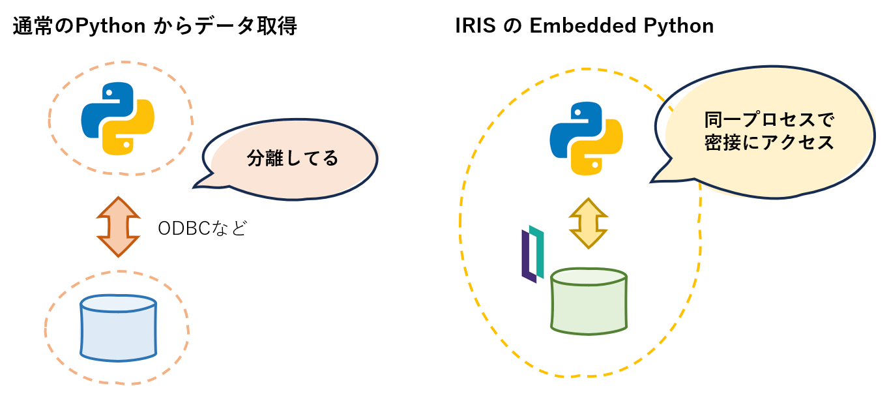

# Embedded Python で IRIS データにアクセスしよう

Embedded Python は、IRIS に標準で備わっている「**Python コードで IRIS データにアクセスする**」ための製品機能です。

Embedded Python により Python ロジックが IRIS プロセスとして実行されます。これにより、さまざまな Python ライブラリと IRIS データを密接に組み合わせることができ、アプリケーションに大きなメリットをもたらします。

このワークショップを通じて、Embedded Python で IRIS データやメソッドにアクセスする具体的なコードを体験いただけます。

# 目次などなど

- [1. Embedded Python とは](#1-embedded-python-とは)
- [2. Embedded Python の実行手段](#2-embedded-python-の実行手段)
- [3. Embedded Python で IRIS リソースにアクセス](#3-embedded-python-で-iris-リソースにアクセス)
    - [3-0. 事前準備](#3-0-事前準備)   
    - [3-1. クラスメソッド](#3-1-クラスメソッド)
    - [3-2. グローバルデータ](#3-2-グローバルデータ)
  

## 1. Embedded Python とは

「Embedded」という名前のとおり、IRIS 製品に「埋め込まれた」 Python です。IRIS プロセス上で Python ロジックを動作させることが出来ます。この「IRIS プロセスとして動作する」というのが大きな特徴で、IRIS のデータや IRIS ネイティブ言語である ObjectScript と Python とが密接かつシームレスに連携することが可能となります。

IRIS 2024.1 for Windows では、一般的な Python モジュールではなく、IRIS 製品に同梱されている irispython.exe が内部的に利用されます。

## 2. Embedded Python の実行手段

Embedded Python を実行する方法は、以下の 3 種類あります。実際のアプリとしては **"1"** がお勧めです。
上で説明しましたが、OS から見ると、どれも通常の IRIS プロセスとして起動しています。

1. クラスに **[Language = python]** を宣言したメソッドを登録して実行する。メソッド内部に Python 言語を記述する。

        ClassMethod hello() [ Language = python ]
        {
            import datetime
            day1 = datetime.date(1976, 5, 22)
            print(day1.isoformat())
        }

2. ObjectScript から %SYS.Python を指定して Python ライブラリをロードする。ObjectScript 言語で記述するため、通常のルーチンからも呼べる。

        set datetime = ##class(%SYS.Python).Import("datetime")
        set day1 = datetime.date(1976, 5, 22)
        write day1.isoformat()

3. IRIS ターミナルから :py コマンドで Embedded Python 用のシェルを起動することで、（一般の Python Shell と同じように）インタラクティブに実行する。

        USER>:py
         
        Python 3.9.19 (main, Jul 18 2024, 18:05:27) [MSC v.1927 64 bit (AMD64)] on win32
        Type quit() or Ctrl-D to exit this shell.
        >>> import datetime
        >>> day1 = datetime.date(1976, 5, 22)
        >>> print(day1.isoformat())
        1976-05-22

## 3. Embedded Python で IRIS リソースにアクセス

ここから、Embedded Python を使って、実際に IRIS のデータやクラスにアクセスしてみましょう。基本的に IRIS リソースにアクセスするときは、iris パッケージを利用します。Embedded Python には iris パッケージは標準で含まれており、 **import iris** で利用できます。

このワークショップでは、上記の **3**、IRIS ターミナルから :py コマンドで起動する Embedded Python 用のシェル上で行います。**>>>** がプロンプトです。

        USER>:py
        >>>

### 3-0. 事前準備

IRIS に以下のクラスを登録し、テストデータをセットしておきます。

        Class User.test Extends %Persistent
        {        
        property name As %String;

        ClassMethod sum(x1 As %Integer, x2 As %Integer) As %Integer
        {
            quit $g(x1)+$g(x2)
        }
        
        ClassMethod init()
        {
            kill ^User.testD
            &sql( insert into test (name) values ('Naka') )
            &sql( insert into test (name) values ('Sato') )          
            kill ^a
            set ^a=55, ^a(1)=123, ^a(1,4)=999
        }

        }

データ登録（テーブルデータ と ^a を保存）

        USER>do ##class(User.test).init()

### 3-1. クラスメソッド

IRIS クラスメソッドは、iris パッケージを使って、以下のように実行します。

        import iris
        ret = iris.cls('classname').methodname(arg)

たとえば、User.test クラス sum メソッドを、Embedded Python Shell から呼んでみましょう。

        >>> import iris
        >>> a = 2
        >>> b = 1
        >>> ans = iris.cls('User.test').sum(a, b)
        >>> print(ans)
        3

### 3-2. SQL

IRIS テーブルにたいして、iris パッケージを使って、以下のように SQL を実行します。

        import iris
        st = iris.sql.prepare('SQL statement')
        rs = st.execute(param)

たとえば、User.test テーブルに対して、Embedded Python Shell から SQL をいくつか実行しましょう。

(1) select name from test

        >>> import iris
        >>> st = iris.sql.prepare('select name from test')
        >>> rs = st.execute()
        >>> for row in rs:
        ...   print(row[0])
        ...
        Naka
        Sato

(2) insert into test (name) values (...)

        >>> st2 = iris.sql.prepare('insert into test (name) values (?)')
        >>> rs2 = st2.execute('Yama')

(3) select name from test where ID = ...

        >>> st3 = iris.sql.prepare('select name from test where ID=?')
        >>> rs3 = st3.execute(3)
        >>> for row in rs3:
        ...   print(row[0])
        ...
        Yama
        

### 3-2. グローバルデータ

        set ^a=55
        set ^a(1)=123
        set ^a(1,4)=999

に対して、Embedded Python からは、以下のように GET/SET できます。

        ClassMethod test1() [ Language = python ]
        {
           import iris
           g = iris.gref('a')
           
           # データを取得 (トップノードは [None])
           print( g[None] )
           print( g['1'] )
           print( g['1','4'] )
           
           # ^aを更新
           g[None] = 555
           g['test'] = 100
        }

実行例

        USER>do ##class(User.test).test1()
        55
        123
        999

        USER>zw ^a
        ^a=555
        ^a(1)=123
        ^a(1,4)=999
        ^a("test")=100        

ああ
   
