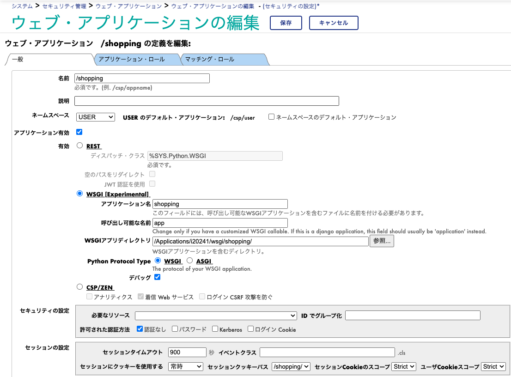
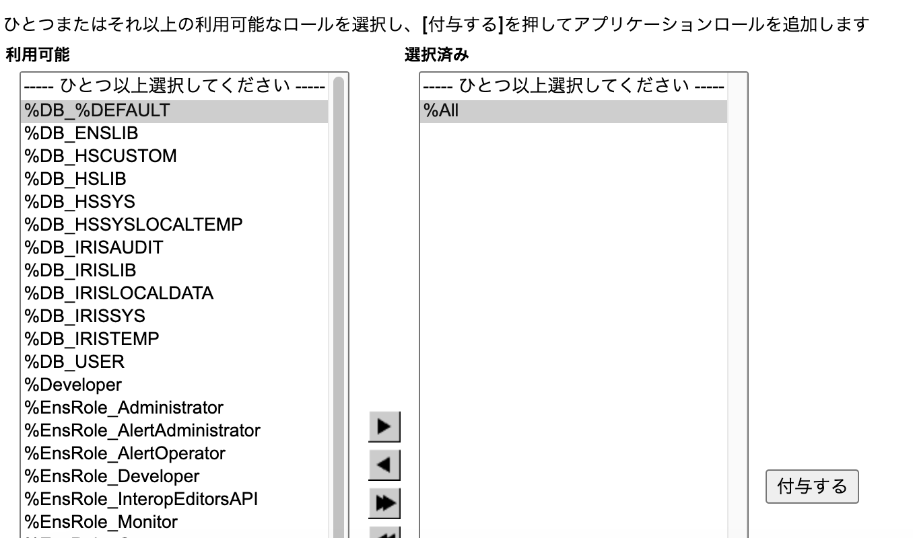

# WSGI-FlaskでショッピングWebアプリケーションを作る

IRIS 2024.1 には、Pytyhon WSGIに準拠するWebアプリケーションを作成・管理する機能が含まれています。
このハンズオンでは、WSGIに準拠したWebフレームワーク・Flaskを利用して、
シンプルなショッピングカート機能を持つWebアプリケーションを作成します。


# 目次

- [1. WSGIとは](#1-wsgi-とは)
- [2. WSGI準拠のWebフレームワーク Flask](#2-wsgi準拠のwebフレームワーク-flask)
- [3. IRISへWebアプリケーションをデプロイ](#3-irisへwebアプリケーションをデプロイ)
- [4. データベースの準備](#4-データベースの準備)
- [5. ショッピングWebアプリケーションの実装](#5-ショッピングwebアプリケーションの実装)
- [6. トラブルシューティング](#6-トラブルシューティング)

## 1. WSGI とは

WSGIはWeb Server  Gateway Interfaceの略で、ウィズギー　もしくは、ウィスキーと発音します。
WSGIは、WebサーバーとPythonアプリケーション間の通信を可能にし、Webアプリケーションの開発を容易にします。


この図は、Webアプリケーションの簡単なアーキテクチャーを示しています。
WebサーバーはHTTPリクエストを受けとり、適切なリソースを提供する役割があります。
Webアプリは、動的なコンテンツを提供したり、様々な機能を提供します。Pythonでは、djangoやFlaskといったWebフレームワークを利用してWebアプリが開発されることが多いです。

通信の流れとしては、
WebブラウザからHTTP requestが発生し、Webサーバーに到着します。
WebサーバーはWebアプリの機能を呼び出したいのですが、WebサーバーにはWebアプリを直接呼び出すことができません。このとき、Webアプリの機能を呼び出すのが中間サーバーである、WSGIの役割となります。

### IRISでWSGI準拠のWebアプリを管理可能に
IRIS 2024.1では、DjangoやFlaskといったWSGIに準拠するWebアプリケーションをローンチ・管理することが可能になりました。IRISに配置されたWebアプリに関して、IRISがWSGIサーバーとして振る舞うため、別途WSGIサーバーを用意する必要がありません。


## 2. WSGI準拠のWebフレームワーク Flask

[Flask](https://flask.palletsprojects.com/en/stable/) は、WSGIに準拠した Python Webフレームワークです。シンプルな設計でありながら、多くの拡張機能により、Webアプリケーションに必要な機能を追加できるのが特徴で、人気のあるWebフレームワークの一つです。

さっそくFlaskをインストールしてみましょう。

### Flaskのインストール

pipを利用して、flaskをインストールします

        pip install --target /(IRISインストールディレクトリ)/mgr/python flask

### インストールの確認

IRIS ターミナルから:py コマンドで Embedded Python用のシェルを起動し、flaskがインストールされていることを確認します。

        USER>:py
        >>> import flask
        (エラーが起きないことを確認)

### Flaskをローカルで動作させる

次に、ローカルでFlaskを実行し、ブラウザでのアクセスを確認してみましょう。

下記をエディタで作成し、shopping.pyとして保存してください。

```Python:shopping.py
from flask import Flask
app = Flask(__name__)

@app.route('/', methods=['GET'])
def meetup():
    name = "Hello MeetUp!"
    return name

@app.route('/product/<product_code>')
def product_detail(product_code):
    contents = f"製品コード：{product_code} の製品の詳細を表示します。"
    return contents

if __name__ == "__main__":
    app.run(debug=True)
```

### Flaskを実行
ターミナルを起動し、作成したコードを実行します。

    python shopping.py

#### ブラウザで確認

Webブラウザで動作確認を行います。Flaskのデフォルトのポートは5000です。

 - localhost:5000にアクセスし、"Hello MeetUp!"と表示される。

 - localhost:5000/product/A-100 にアクセスすると、"製品コード: A-100の・・"と表示される。

※ こうしてWebブラウザからアクセスできるのは、Flaskに、開発・テスト用の簡易Webサーバーが内包されているためです。

(A-100の部分は任意の英数字に置き換えても動作することを確認してください。ただ、日本語は別の処理が必要なため、ここでは対応していません) 


#### コードの解説
- `from flask import Flask` でflaskをインポートしています。

- `app = Flask(__name__)` でFlaskのインスタンスを作成します。__name__は現在のモジュール名を指し、Flaskがアプリケーションを正しく設定するために使用します。

- meetup関数では、`@app.route('/')`によりルート（エンドポイント）を定義します。この場合、ルートはアプリケーションのホームページ（/）です。これはFlaskのRouting機能によるものです。
`methods=['GET']`は、HTTPメソッドを指定しています。ここではHTTP GETリクエストがこのルートにアクセスできることを示します。
  - HTTPメソッドは通信の役割を示すもので、下記が主要なHTTPメソッドです。
    - GET: サーバーから情報を取得する
    - POST: サーバーに情報を送信する
    - DELETE: サーバー上のリソースを削除する
    - PUT: サーバー上の既存のリソースを更新する
    - PATCH: サーバー上のリソースを部分的に更新する

  - meetup関数は、アクセスされたときに"Hello MeetUp!"という文字列を返します。

- product_detail関数では、
`@app.route('/product/<product_code>')`により、/product/<product_code>というURLパターンを持つルートを定義します。`<product_code>`はプレースホルダーで、URLの一部として任意の値を受け取ります。関数の処理として、受け取った値を利用したメッセージを返します。

- `if __name__ == "__main__":`
    `app.run(debug=True)`
  この部分は、スクリプトが直接実行されたときにFlaskアプリケーションを起動します。
debug=Trueを指定すると、デバッグモードが有効になり、エラーが発生した場合に詳細なトレースバックが表示され、コードの変更を自動的に検知して再起動します。


これで、Flaskで、かんたんな記述でWebのルーティングができることを確認できました。
このように、FlaskではWebアプリケーションに必要な様々な部品が用意されています。

## 3. IRISへWebアプリケーションをデプロイ

IRISに今作成したWebアプリをデプロイしてみましょう。

まず、さきほど作成したshopping.pyを、IRISがアクセスできる場所に配置します。

例： /(IRISインストールディレクトリ)/WSGI/shopping.py 

IRIS管理ポータルより、
[システム管理] -> [セキュリティ] -> [アプリケーション] -> [ウェブアプリケーション]
-> [新しいWebアプリケーション] を選択します。

下記を入力します。

- [名前] /shopping
- [ネームスペース] USER
- [アプリケーション有効] チェック
- [有効] WSGIを選択
- [アプリケーション名] shopping
  - flaskのファイル名から".py"を取り除いた部分
- [呼び出し可能な名前(Callable Name)] app  
  - `app = Flask(__name__)` の変数名を指定
- [WSGI アプリディレクトリ (WSGI App Directory)] (shopping.pyを配置したディレクトリを指定)
- [Python Protocol Type (2024.2以降のみ)] WSGIを選択
- [デバッグ(2024.2以降のみ)] チェック (チェックするとソースの更新が自動的に反映されます。)

保存 をクリックします。




アプリケーション・ロール タブにて、ロールを選択します。
ここでは、%All を選択し、付与する　をクリックします。




※ 実運用では必要な権限のみを付与してください。

※ アプリケーションロール設定は、初期セキュリティ設定：最小 でIRISをインストールされた方には不要(UnknownUserが%All権限を持っている)ですが、手順の確認のために記載しています。

### Webブラウザで確認

Webブラウザで動作確認します。

- (サーバーURL)/shopping/ にアクセスし、"Hello MeetUp!" と表示されることを確認します。

- (サーバーURL)/shopoping/product/Z123 にアクセスし、"製品コード: Z123 の・・" と表示されることを確認します。

これで、IRISにFlaskで作成したWebアプリケーションをデプロイし、動作することが確認できました。

## 4. データベースの準備

Webアプリケーションからデーターベースにアクセスしますが、
事前準備としてデータベーステーブルの作成、データの登録を行います。

### テーブルの作成

 "3-b.sqlalchemy"のハンズオンでも共通で利用するテーブルを作成します。
下記を実施することで、製品(Product), 取引(Transactions), 取引明細(TransactionItem)の3つのテーブルをIRISに作成します。(※Customerテーブルはこのハンズオンでは利用しませんが作成しても構いません。)

3-b.sqlalchemyの[5.1. IRISでのクラス(テーブル)作成](https://github.com/Intersystems-jp/meetup2024WorkShop/blob/main/3-b.sqlalchemy/README.md#51-iris%E3%81%A7%E3%81%AE%E3%82%AF%E3%83%A9%E3%82%B9%E3%83%86%E3%83%BC%E3%83%96%E3%83%AB%E4%BD%9C%E6%88%90)を実施してください。

(src\User フォルダに Product.cls、Transacdtion.cls、TransactionItem.clsを作成し、コンパイルを行います。IRISの接続先はUserネームスペースとしてください。)

実施すると、IRIS上に下記のテーブルが作成されます。

#### テーブル名: Product (製品)

|日本語名|フィールド名|データ型|
|-----|-----|----|
|製品番号|ProductCode|文字列|
|製品名|ProductName|文字列|
|価格|Price|Integer|

#### テーブル名: Transactions (取引)

|日本語名|フィールド名|データ型|
|-----|-----|----|
|ID|ID|数字|
|取引時刻|TransactionDateTime|Posix時刻|
|顧客|Customer|Customer参照|
|合計金額|Total|数字|

#### テーブル名: TransactionItem (取引明細)

|日本語名|フィールド名|データ型|
|-----|-----|----|
|製品|Product|Product参照|
|単価|UnitPrice|数値|
|個数|Quantity|数値|
|取引|Transactions|Transactions参照|

### データの登録

製品のデータが必要ですので、データを登録します。(なお、"3-b.sqlalchemy"で作成する製品メンテナンス機能を利用してデータを登録することもできます)

IRIS管理ポータルより、
[システムエクスプローラ] -> [SQL] にアクセスし、
ネームスペースをクリックしてUSERに変更します。
クエリ実行のタブから、SQL文を記載し、実行をクリックします。

※ ターミナルでIRISにアクセスし、`:sql` と入力してSQL文を実行する方法もあります。

#### 実行するSQL文

下記INSERT文でサンプルとなるデータを登録します。
例として２種類のデータ(調理家電データと、WSGIの読み方にちなんだデータ)を用意しました。

お好きな方（もしくは両方）を登録してください。

    -- 調理家電データ
    INSERT INTO Product (ProductCode, ProductName, Price) VALUES ('CK-EK', '電気ケトル', 3000);
    INSERT INTO Product (ProductCode, ProductName, Price) VALUES ('CK-TT', 'トースター', 4000);
    INSERT INTO Product (ProductCode, ProductName, Price) VALUES ('CK-FP', 'フードプロセッサー', 5000);
    INSERT INTO Product (ProductCode, ProductName, Price) VALUES ('CK-HB', 'ホームベーカリー', 15000);
    INSERT INTO Product (ProductCode, ProductName, Price) VALUES ('CK-AC', '自動調理鍋', 25000);

    -- WSGIの読み方にちなんだデータ
    INSERT INTO Product (ProductCode, ProductName, Price) VALUES ('WK-ASHB', 'ブルーニッカ', 1000);
    INSERT INTO Product (ProductCode, ProductName, Price) VALUES ('WK-STRYK', '角行', 2000);
    INSERT INTO Product (ProductCode, ProductName, Price) VALUES ('WK-STRYY', '大山崎', 13000);
    INSERT INTO Product (ProductCode, ProductName, Price) VALUES ('WK-SCOTJ', 'John Walker', 5000);
    INSERT INTO Product (ProductCode, ProductName, Price) VALUES ('WK-SCOTA', 'Artbeg', 10000);

## 5. データベースを活用したWebアプリを作成

製品をデータベースから取得し、リストアップする機能を実装してみましょう。


### shopping.pyの編集

"3. IRISへWebアプリをデプロイ"で作成したshopping.pyを変更します。


importは下記のようにします。render_templateはhtmlに情報を渡して描画する(テンプレートエンジン)ために必要です。
`import iris`は、IRISのリソースにPythonからアクセスするために必要です。

    from flask import Flask, render_template
    import iris


製品(Product)テーブルのデータを取得する関数を記載します。

SQLのSELECT文により製品テーブルから情報を取得しています。

    def list_products():
        sql = "select ProductCode, ProductName, Price from product"
        # SQLステートメントの準備
        stmt = iris.sql.prepare(sql)
        # 結果セットの取得
        rset = stmt.execute()
        return rset
            
ルートを一つ追加します。/productsにアクセスすることにより、製品一覧を取得できるページとします。
list_products関数をよびだし、製品データを取得しています。

render_template によりproducts.htmlをテンプレートとして利用し、パラメーターとして製品のデータを渡し、HTMLを出力します。


    @app.route('/products', methods=['GET'])
    def get_products():
        products = list_products()
        return render_template("products.html", products=products)

これで、shopping.pyは次のようになりました。

    from flask import Flask, render_template
    import iris

    app = Flask(__name__)

    def list_products():
        sql = "select ProductCode, ProductName, Price from product"
        # SQLステートメントの準備
        stmt = iris.sql.prepare(sql)
        # 結果セットの取得
        rset = stmt.execute()
        return rset

    @app.route('/', methods=['GET'])
    def meetup():
        name = "Hello MeetUp!"
        return name

    @app.route('/product/<product_code>')
    def product_detail(product_code):
        contents = f"製品コード：{product_code} の製品の詳細を表示します。"
        return contents

    @app.route('/products', methods=['GET'])
    def get_products():
        products = list_products()
        return render_template("products.html", products=products)

    if __name__ == "__main__":
        app.run(debug=True)

#### products.htmlの作成

templatesフォルダを作成し、その配下にproducts.htmlを作成します。

つまりディレクトリ構成は、下記のようにします。

    shopping.py
    └── templates
        └── products.html

products.htmlを次のように作成します。

    <!DOCTYPE html>
    <html lang="ja">
    <head>
        <meta charset="UTF-8">
        <meta name="viewport" content="width=device-width, initial-scale=1.0">
    </head>
    <body>
        
        <table>
            <thead>
                <tr>
                    <th>製品コード</th>
                    <th>製品名</th>
                    <th>金額</th>
                </tr>
            </thead>
            
            <tr>
                <td>{{ item[0] }}</td>                
                <td>{{ item[1] }}</td>
                <td>{{ item[2] }}</td>
            </tr>
            
        </table>
        
    </body>
    </html>


`` -  ``  で製品(products)データが存在する場合のみ、テーブルを描画するようにしています。

`` - `` で 製品データをループさせ、`{{ item[n] }}`で それぞれの項目を表示しています。

これらは、Flaskのデフォルトのテンプレートエンジンである[Jinja](https://jinja.palletsprojects.com/en/stable/templates/)の機能となります。

### ソースの反映

IRIS 2024.2以降で "3. IRISへWebアプリをデプロイ" で "デバッグ"のチェックをONにした場合、ソースを編集/配置した時点で、
変更が反映されます。

上記以外の場合、ソースの変更を反映させるには、ソースを編集/配置した後、IRISを再起動する必要があります。


### Webブラウザで確認

Webブラウザで動作確認します。

・(サーバーURL)/shopping/products にアクセスします。

製品の一覧が表示され、製品コード、製品名、金額が表示されることを確認します。

これで、IRISにデプロイしたWebアプリケーションからデータベースへアクセスし、データを取得することが確認できました。

## 5. ショッピングWebアプリケーションの実装

このセクションでは、ショッピングWebアプリケーションを作成していきます。

1つのPythonファイル、4つのhtmlファイルを作成(編集)します。


下記のソースを作成(もしくは編集)していきましょう。

##### メイン処理
ソースコード： [src/shopping.py](src/shopping.py)

各ページへのルーティングや処理、データアクセス処理などを記載しています。

詳細は [メイン処理の詳細解説](#メイン処理の詳細解説) で解説します。


##### 製品一覧ページ
ソースコード： [src/templates/products.html](src/templates/products.html)

- 製品一覧を表示します。
  - 製品の右端にはカートに入れるボタンを設置し、押下するとカート追加処理を呼び出します。 

#### カートへの追加ページ
ソースコード： [src/templates/cart_added.html](src/templates/cart_added.html)

- 製品名とともにカートへの追加したことを示すメッセージを表示します。
- カートの中身を見るボタンを設置します。押下するとカート表示処理を呼び出します。

#### カートページ
ソースコード： [src/templates/cart.html](src/templates/cart.html)

- カート内を表示します。総合計金額を表示します。
- 製品一覧ページへ戻るためのボタン、支払いをするためのボタンを設置します。支払いボタンを押下すると支払処理を呼び出します。

#### 支払い完了ページ
ソースコード： [src/templates/checkout_success.html](src/templates/checkout_success.html)

- 支払いが完了したことを示すメッセージを表示します。
- 合計金額を表示します。
- 製品一覧へ戻るためのボタン、支払履歴を確認するボタンを設置します。
  - 支払い履歴を確認する機能はこのハンズオンでは未実装ですが、
    直接データベースにアクセスし、取引テーブル、取引明細テーブルを確認することで支払い処理を確認することができます。

### メイン処理の詳細解説

メインの処理を記載している [src/shopping.py](src/shopping.py) について解説します。(これまで説明した関数は省きます。)

#### get_product_by_code関数 

    def get_product_by_code(product_code):
        sql = "select ID from product where ProductCode=?"
        # SQLステートメントの準備
        stmt = iris.sql.prepare(sql)
        # 結果セットの取得
        rset = stmt.execute(product_code)
        for product in rset:
            return iris.cls('User.Product')._OpenId(product[0])
        return None


製品コードから製品データを1件取得し、製品オブジェクトを返します。
- SQLのSELECT文で製品コードにより製品データを取得した後、_OpenIdでProductのオブジェクトを取得し、返しています。

#### add_to_cart関数
    @app.route('/cart/add/<product_code>', methods=['POST'])
    def add_to_cart(product_code):
        # 製品コードから製品データを取得
        product = get_product_by_code(product_code)
        if product is None:
            return jsonify({'message': 'Product not found!'}), 404

        if 'cart' not in session:
            # Session内の'cart'初期化
            session['cart'] = {}
        
        # カートの当該製品の件数をインクリメント
        session['cart'][product_code] = session['cart'].get(product_code, 0) + 1
        
        # セッションの変更を通知
        session.modified = True  
        return render_template('cart_added.html', product_name=product.ProductName)

ショッピングカートに製品を追加します。

- ルーティング定義により/cart/add/<製品コード> のPOST通信の際にこの関数が呼ばれるようにしています。
- パラメーターの製品コードから製品データを取得します。
- セッション内に保持しているカート内の当該製品コードをインクリメント(+1)します。これは当該製品のカート内の件数をあらわします。
  - 一般的にセッションは、クライアント(ブラウザ)とサーバ間での状態を管理するための仕組みです。
- 製品名をパラメーターとしてcart_added.htmlを描画しています。

#### view_cart関数

    # カートの内容を表示
    @app.route('/cart', methods=['GET'])
    def view_cart():
        # セッションよりカート情報を取得
        cart = session.get('cart', {})

        cart_items = []
        total = 0
        for code, quantity in cart.items():
            # 製品コードより製品を取得
            product = get_product_by_code(code)
            if product is not None:
                # 表示するためのカート情報をセット
                cart_items.append({
                    'ProductCode': code,
                    'ProductName': product.ProductName,
                    'Quantity': quantity,
                    'UnitPrice': product.Price,
                    'TotalPrice': product.Price * quantity
                })
                total += product.Price * quantity
        return render_template('cart.html', items=cart_items, total=total)

カートの内容を表示します。
- ルーティングとして /cartのGET通信の際にこの関数が呼ばれます。
- セッションよりカート情報を取得します。
- カートの製品コードから製品データを取得します。
- 表示用にcart_itemsに情報をセットし、合計金額を算出します。
- cart_itemsと合計金額をパラメータとして、cart.htmlを描画します。

#### checkout関数

    @app.route('/checkout', methods=['POST'])
    def checkout():
        if 'cart' not in session or not session['cart']:
            return "カートの中身が空です。"

        # 取引オブジェクトを生成
        ts = iris.cls('User.Transactions')._New()    

        total = 0
        # カート内をループ
        for code, quantity in session['cart'].items():
            # 製品コードより製品データを取得
            product = get_product_by_code(code)

            if product is not None:
                # 支払い明細オブジェクトの生成
                item = iris.cls('User.TransactionItem')._New()
                item.Transactions = ts
                item.Product = product
                item.UnitPrice = product.Price
                item.Quantity = quantity

                # 支払い明細の登録
                item._Save()
                total += product.Price * quantity
        # 合計金額
        ts.Total = total

        # 現在時刻をセット
        ts.TransactionDateTime= iris.cls('%Library.PosixTime').CurrentTimeStamp()
        
        # 取引の登録
        ts._Save()

        # セッションよりカートをクリア
        session.pop('cart', None)

        # セッションの変更を通知
        session.modified = True  
        return render_template('checkout_success.html', total=total)

支払い処理を行います。
- ルーティングとして/checkout にPOST通信が発生した際にこの関数が呼ばれます。
- カートより、製品データを取得します。
- 製品ごとに、取引明細データ(取引、製品、単価、件数)を登録します。
  - たとえば製品が3種類カート内にあれば、3件の取引明細データが登録されます。
- 取引データ(合計金額、現在時刻)を1件登録します。
- 購入が終わればカートは空にする必要がありますので、セッションのカート情報をクリアします。
- 合計金額を引数として checkout_success.htmlを描画します。


### HTMLページの解説

#### CSSフレームワークの活用

Webの見た目を整えるためにCSS(Cascading Style Sheets)が必要となりますが、
CSSのコーディングは煩雑で、ブラウザごとの対応が必要だったり、モバイル/デスクトップなどの多くのデバイスの差異に対応するのには非常に骨の折れる作業となります。そこで効率的に見た目を整えることができるCSSフレームワークが活用されることが多くなっています。

このハンズオンでは、CSSフレームワークとして代表的なBootstrapを利用し、見た目を調整しています。


HTMLのhead部分で読み込みを行います。

    <link href="https://cdn.jsdelivr.net/npm/bootstrap@5.3.0/dist/css/bootstrap.min.css" rel="stylesheet" integrity="sha384-9ndCyUaIbzAi2FUVXJi0CjmCapSmO7SnpJef0486qhLnuZ2cdeRhO02iuK6FUUVM" crossorigin="anonymous">

classでBootstrapでどのような見た目にするのかの指示を行います。

下記はcheckout_success.htmlでのリンク、ボタンの例です。
aタグはリンクですが、classを指定することで、ボタンのような見た目にしています。

    <a href="(略))" class="btn btn-secondary">製品一覧へ戻る</a>
    <button class="btn btn-info" onclick="alert('(略)')">支払い履歴を確認する</button>

下図は、classを指定しなかった場合(BootstrapによるCSSが効いてない場合)の見た目です。


下図が、classを指定しBootstrapによるCSSが効いている見た目となります。


Bootstrapのボタンについての詳細なコーディング方法は[Bootstrap Buttons](https://getbootstrap.jp/docs/5.3/components/buttons/) をご覧ください。

Bootstrap全般については [Bootstrap](https://getbootstrap.jp/)をご覧ください。


#### アイコンの活用

アイコンを表示するために、[Bootstrap Icons](https://icons.getbootstrap.jp/) を利用しています。

head部分で 読み込みを行います。

        <link href="https://cdn.jsdelivr.net/npm/bootstrap-icons/font/bootstrap-icons.css" rel="stylesheet">


アイコンを利用する際には下記のようにclassを指定します。

        <i class="bi bi-shop"></i>ショッピング

これで下図のようにアイコンが表示されます。


詳細な利用方法は [Bootstrap Icons](https://icons.getbootstrap.jp/) をご覧ください。

#### エンドポイントURLの生成

Flaskのurl_for関数を使用して、エンドポイントとなるURLを生成しています。
たとえば、products.htmlのカートの中身を見るボタンのForm部分のコードは下記のようになっています。

        <form action="{{ url_for('add_to_cart', product_code=item[0]) }}" method="POST">


`{{ url_for('add_to_cart', product_code=item[0]) }}` の部分は、url_for関数により、shopping.pyのadd_to_cart関数に対応したURLが製品コードの引数とともに生成されます。
ブラウザに出力される際には下記のようなコードなります。

        <form action="/shopping/cart/add/(製品コード)" method="POST">

なお、HTMLの仕組みとして、formタグはユーザーの入力を受け取り、通信を行うためのものです。
ここでは、actionで指定されたURL(/shopping/cart/add/(製品コード))に対して、methodで指定されたPOST通信を行います。
submitボタン(ここでは"カートに入れる"ボタン)が押下されたときに通信が発生します。

そうすると、下図のshopping.pyで定義したルーティングによって、add_to_cart関数が実行されることになります。

    @app.route('/cart/add/<product_code>', methods=['POST'])
    def add_to_cart(product_code):
        (略)

### Webブラウザで確認


 (サーバーURL)/shopping/products にアクセスします。
 
- カートへの追加、カートの表示、支払処理を試してみてください。
- 支払い処理を行うと、取引テーブル、取引明細テーブルにデータが生成されます。
データベースにアクセスし、取引テーブル(Transactions)、取引明細テーブル(TransactionItem)にデータが登録されていることを確認してみてください。

以上で、このハンズオンは完了です。機能はシンプルなものにとどめていますが、Webアプリ開発の一助となれば幸いです。

#### Note
- 今回のソースコードは、下記については考慮されていません。
  - エラー処理 / トランザクション / ロック / 認証
- JavaScriptを(ほとんど)利用しない設計にしたため、UI/UXは簡素なものとなっています。

## 6. トラブルシューティング

### ソースの変更が反映されない

[ソースの反映](#ソースの反映)  をご確認ください。

### エラーログを確認したい

ログは下記に出力されます。

  `(IRISインストールディレクトリ)/mgr/WSGI.log`


